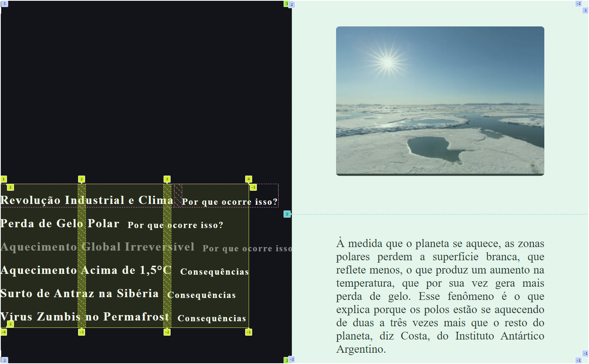
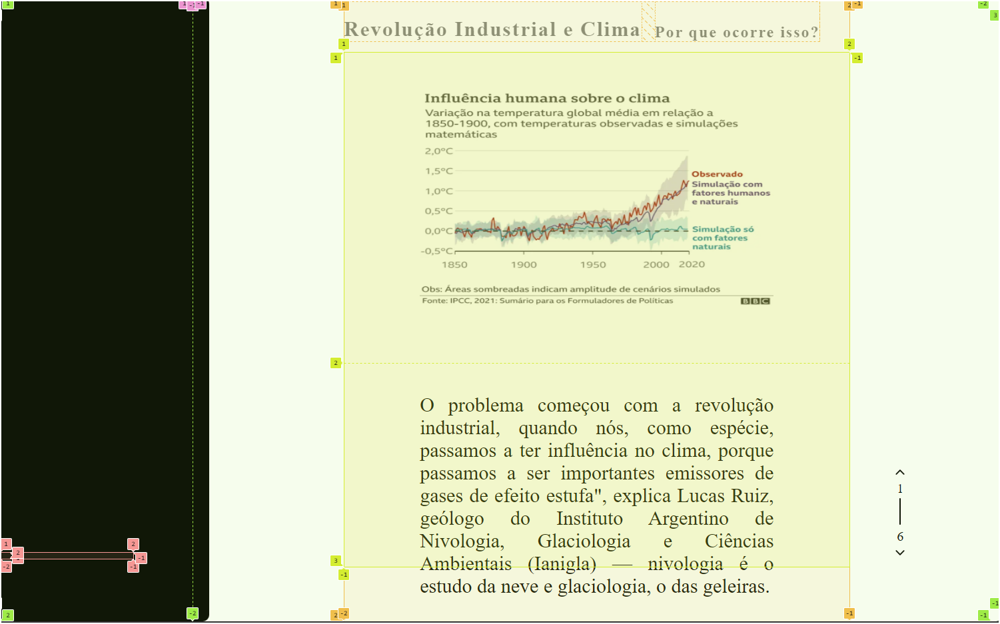

# Causas

Isso existe para demonstrar a situação atual da página de 'Causas', e o que ainda vai ser implementado.

## O que foi feito até aqui?
- [x] Dev. Layout(Figma)
    - [ ] Mobile
- [x] Dev. Layout(Alternativa)
    - [ ] Mobile
- [ ] Adição de comentérios ao código 
    - [x] HTML
    - [x] CSS
    - [x] JS
- [ ] Executar scripts diferentes dependendo do dispositivo

## Correções e novas features?

-[ ] Quebra de Layout
Descrição: Ao reduzir a tela o layout quebra. Relacionado a !Responsividade.

ponto de critico 1580px

Ideia de solução: aplicar um layou similar ou igual ao mobile, com diferença de script.

